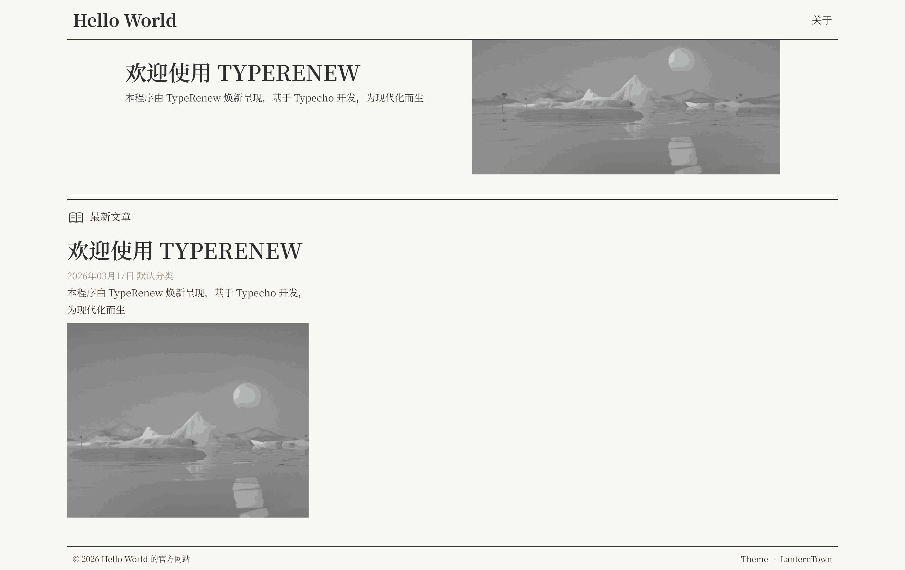

# LanternTown

一款报纸风格的 Typecho 主题，简约复古，适配 PHP 8 与 MySQL 8，原生支持 TypeRenew ，QQ 交流群：1073739854

## 预览



## 特性

- **原生适配 TypeRenew** - TypeRenew 是基于 Typecho 所开发的现代化 CMS 程序，详见：https://github.com/Yangsh888/TypeRenew
- **复古报纸风格** - 简约优雅的排版设计
- **四种主题色** - 复古黄、纯白色、灰白色、暗夜黑
- **响应式设计** - 完美适配各种屏幕尺寸
- **PHP 8+ 支持** - 严格类型声明，现代语法
- **安全加固** - XSS 防护、CSRF 验证、安全响应头
- **图片懒加载** - IntersectionObserver 实现
- **Markdown 增强** - Prism 代码高亮、Fancybox 图片灯箱

## 安装

1. 从 Release 中下载压缩包。
2. 进入站点 `/usr/themes/` 目录
3. 将下载的压缩包上传至 `/usr/themes/`目录内，解压文件。
4. 登录后台，进入「控制台 → 外观」，启用主题
5. 进入「外观 → 设置外观」配置主题选项

## 主题色

| 主题色 | 适用场景 |
|--------|----------|
| 复古黄 | 默认风格，温暖怀旧 |
| 纯白色 | 简洁清爽 |
| 灰白色 | 低对比度，护眼 |
| 暗夜黑 | 深色模式 |

## 配置项

- 站点 LOGO
- 首页推荐文章
- 备案号
- favicon 图标
- 首页随机图片
- 翻页模式（页码/瀑布流）
- 主题色切换
- 版权声明
- 作者简介
- 打赏二维码
- 社交媒体链接

## 目录结构

```
lanterntown/
├── libs/           # 核心函数库
├── public/         # 公共模板组件
├── component/      # 页面组件
├── assets/         # 静态资源
│   ├── css/
│   ├── js/
│   └── img/
└── functions.php   # 主题配置
```

## 技术栈

- PHP 8.0+
- MySQL 8.0+ / PostgreSQL / SQLite
- Swiper 轮播
- Prism 代码高亮
- Fancybox 图片灯箱
- Headroom 导航隐藏

## 开源许可协议

本项目基于 GNU General Public License 2.0 协议开源。

核心条款：

- 可以自由使用、修改、分发本软件
- 分发时必须保留原始版权声明和许可证
- 修改后的版本必须以相同协议开源
- 不提供任何担保，作者不承担使用本软件产生的任何责任

完整协议文本见 [LICENSE](LICENSE) 文件或访问 [GNU GPL 2.0](https://www.gnu.org/licenses/old-licenses/gpl-2.0.html)。
